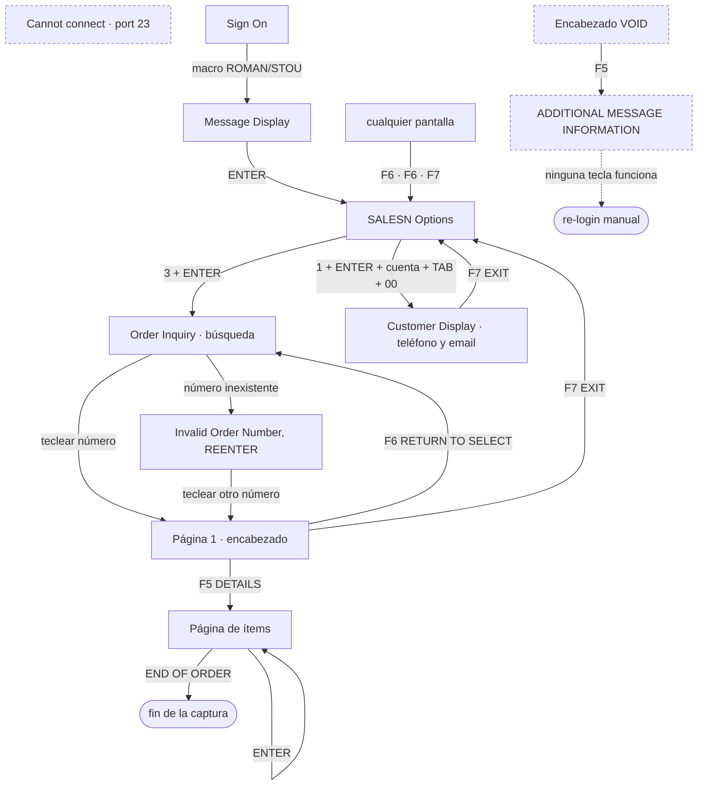

# Mapa de pantallas del AS400 (SALESN · Order Inquiry)

> Estado: **referencia viva**, 1 sep 2026. Escrito antes de seguir tocando la captura, a petición
> de Rafael: *«quisiera tener documentado o mapeado cada pantalla con la info que contiene y la
> funcionalidad que se puede aprovechar»*.

**Regla de evidencia de este documento.** Todo lo que se afirma aquí tiene detrás una captura real
(los *fixtures* de `tests/` salieron de `Peek` sobre el terminal de verdad) o el código que la lee.
Cada pantalla cita su fuente. **Lo que no está verificado va marcado ❓ y no se da por cierto** —
inventar el contenido de una pantalla es exactamente cómo se rompe una sesión que compartimos con
una persona.

---

## 1. Mapa de navegación



Las tres flechas que importan: **F5 una sola vez** (encabezado → ítems), **ENTER** pagina ítems, y
**F6** vuelve a la búsqueda. Y la que saca de cualquier atasco: **F6, F6, F7** deja el terminal en el
menú desde donde sea (menos en el callejón de §2.10, donde no responde ninguna tecla).

---

## 2. Las pantallas verificadas

Todas se reconocen con el texto **sin espacios y en mayúsculas** (`classify_screen`), porque el 5250
separa las letras (`O R D E R`) y un match literal fallaría.

### 2.1 `Cannot connect to host … , port 23` → `STATE_DISCONNECTED`
*Evidencia:* `tests/test_as400_capture.py:414` (mensaje real reportado).
**Trae:** la IP del host (`47.22.32.213`) y el puerto. Nada más.
**Qué hacemos:** cortar **antes de teclear**. Es la pantalla que existía cuando «Connect AS400»
decía conectado con el host caído.
**Ojo:** gana sobre cualquier otro marcador — una sesión muerta puede seguir mostrando texto de una
orden vieja (`test_classify_disconnected_wins_over_stale_order_text`).

### 2.2 `Sign On` → `STATE_LOGIN`
*Evidencia:* `tests/test_as400_capture.py:54`.
**Trae:** los campos de usuario y contraseña.
**Qué hacemos:** correr el macro `ROMAN → TAB → STOU → ENTER → ENTER → 3 → ENTER`
(`DEFAULT_LOGIN_STEPS`).
**Marcadores:** `SIGNON`, `PASSWORD`.

### 2.3 `Message Display` → `STATE_MESSAGE`
*Evidencia:* `tests/test_as400_capture.py:61`.
**Trae:** un aviso del sistema (`SYS-7300 … routed to W1 from jobname`) y la hora.
**Qué hacemos:** ENTER y seguir. Es un paso de tránsito del login.
**Marcador:** `PRESSENTERTOCONTINUE`.

### 2.4 `SALESN Options` → `STATE_MENU`
*Evidencia:* `tests/test_as400_capture.py:66`.
**Trae — y esto es lo interesante — cuatro opciones, de las que sólo usamos una:**

| Opción | Estado |
|---|---|
| **01. Customer Inquiry** | **mapeada el 1 sep** — es donde está el teléfono (§2.11) |
| 02. Stock File Inquiry | ❓ sin explorar — ¿el stock según AS400? |
| **03. Order Inquiry** | la que usamos |
| 04. Accounts Receivable Inquiry | ❓ sin explorar |
| 06. Display Print Status | ❓ sin explorar |
| 07. Set Terminal Functions | ❓ sin explorar — **no tocar sin motivo**: cambia el terminal |
| 09. Order Entry | ❓ sin explorar — **escribe**, no consultar por curiosidad |
| 10. Order Turn - California | ❓ sin explorar |
| 24. Sign Off | cierra la sesión |

La lista completa (diez opciones) la capturó Rafael el 1 sep 2026; hasta entonces el repo solo
conocía las cuatro primeras. **Dos de ellas no son de lectura** — `09. Order Entry` crea órdenes y
`07. Set Terminal Functions` cambia el terminal: ninguna exploración las abre.

**Qué hacemos:** teclear `3` + ENTER.
**Marcadores:** `SALESNOPTIONS`, `READYFOROPTION`. Se comprueban **antes** que los de pantalla de
orden, porque el menú contiene literalmente el texto «Order Inquiry» y si no, se confundiría.

### 2.5 `Order Inquiry` · búsqueda vacía → `STATE_ORDER_SEARCH`
*Evidencia:* `tests/test_as400_capture.py:74`.
**Trae tres campos de entrada, usamos uno:**

```
 Order Number:                              Account Number:
 Alpha Search:                                     Invoice:
```

| Campo | Uso |
|---|---|
| **Order Number** | el único que tecleamos; al último dígito aparece sola la página 1 |
| Account Number | ❓ nunca usado — ¿lista las órdenes de una cuenta? |
| **Alpha Search** | ❓ nunca usado — ¿busca por nombre de cliente? |
| Invoice | ❓ nunca usado |

**Por qué importa:** hoy el scanner **camina los números de uno en uno** y espera 20 minutos cuando
el siguiente no existe todavía. Si `Alpha Search` o `Account Number` devuelven una **lista**, el
diseño entero del descubrimiento cambia. Es el hueco más caro del mapa.

### 2.6 `Invalid Order Number, REENTER`
*Evidencia:* `tests/test_as400_capture.py:351`.
**Trae:** la misma pantalla de búsqueda **con el campo Order Number vacío** y el mensaje de rechazo.
**Qué hacemos:** `OrderNotFound` → el scanner **no avanza el cursor** y reintenta ese número más
tarde (el número puede existir mañana).
**Trampa conocida:** esta pantalla sigue diciendo «Order Number», así que la clasificación genérica
la daría por válida — por eso se detecta el mensaje explícitamente (`_is_invalid_order`).

### 2.7 `Order Inquiry` · página 1, el encabezado → `STATE_ORDER_INQUIRY`
*Evidencia:* **`tests/test_real_order_881310.py`** (orden 881310 completa, pegada del terminal el
1 sep 2026 — la primera pareja header+ítems byte a byte del repo), más
`tests/test_as400_capture.py:79` y `tests/test_parser_header.py:38`.
**Es la pantalla con más información del sistema** — §3. **No trae teléfono ni contacto** (§5b).
**Qué hacemos:** copiarla, comprobar VOID, y F5.
**Teclas confirmadas (legenda en pantalla):** `Cmd5 DETAILS`, `Cmd6 RETURN TO SELECT`, `Cmd7 EXIT`.
❓ Si hay más teclas activas (imprimir, siguiente orden, histórico) no lo sabemos: la legenda que
tenemos capturada muestra tres.

### 2.8 Encabezado de una orden **VOID**
*Evidencia:* `tests/test_as400_capture.py:35` (reporte del operador, 11 jun 2026).
**Trae:** `Account Number: VOID` y `Bill VOID VOID VOID VOID`.
**Qué hacemos:** F6 y saltar el número **antes de pulsar F5**.
**Por qué:** F5 sobre esta pantalla es lo que lleva al callejón sin salida de §2.10.

### 2.9 `Order Inquiry` · página de ítems
*Evidencia:* `tests/test_as400_capture.py:88`.
**Trae:** el mismo título y la misma línea `Order Number: … Account Number: …` que el encabezado
—por eso el número de orden **no distingue** las dos vistas—, más la tabla de ítems (§4) y, en la
última página, `END OF ORDER` seguido del total.
**Qué hacemos:** acumular y ENTER hasta ver `END OF ORDER`.
**Repite también `Bill <nombre>`** (sin dirección) — otra razón para no usar «Bill» como marca del
encabezado. El encabezado de columnas ocupa **dos líneas**: `Quant Quant Stock # W/H Description
Unit Extend` y debajo `Ord Ship … Price`.

**Su legenda al pie es un hallazgo:**

```
              Enter             Cmd6
              More Details       RETURN TO SELECT
```

**Probado por Rafael el 1 sep 2026:** ese ENTER **no lleva a ninguna pantalla de detalle**. Redibuja
la misma pantalla **sin líneas**, con el `END OF ORDER` y el total todavía puestos. La legenda promete
un «More Details» que no existe (al menos desde la última página).

**Y esa pantalla vacía es una trampa.** Tiene número de orden, cero ítems y `END OF ORDER`: la forma
exacta que el scanner usaba para decidir «orden VOID/vacía → saltar este número **para siempre**».
Sobre la 880996 eso habría descartado en silencio una orden real de 3.965,50 $. Lo que las distingue
es el **Sub-Total del encabezado**: una orden VOID no trae, una real sí, y entonces la suma de líneas
no cuadra. Desde el 1 sep el salto exige además `not total_mismatch`
(`auto_scanner.run_scan_step`, con las dos pantallas reales como test).

El loop se para en el primer `END OF ORDER`, así que no debería llegar ahí — pero **una página de
ítems a medio pintar se lee igual**, y eso se vuelve más probable cuanto más rápido leamos
(`docs/capture-speed-plan.md`, F4).

❓ **No sabemos si hay indicador de página** («Page 1 of 3» o similar). Si lo hubiera, la paginación
podría saber cuántas páginas faltan en vez de descubrirlo pulsando.

### 2.10 `ADDITIONAL MESSAGE INFORMATION` → callejón sin salida
*Evidencia:* `tests/test_as400_capture.py:43`; confirmado por Rafael el 11 jun 2026.
**Trae:** un error `BAS-####` («No matching key») y un prompt `Option:`.
**Qué hacemos:** intentar F6 y saltar el número.
**⚠️ Lo que de verdad hay que saber:** aquí **ninguna tecla funciona** y sólo se sale volviendo a
entrar a mano. Ninguna exploración futura debe entrar aquí a propósito.

### 2.11 `C U S T O M E R   D I S P L A Y` → `STATE_CUSTOMER_DISPLAY`
*Evidencia:* `tests/test_as400_capture.py` (`CUSTOMER_DISPLAY_SCREEN`, capturada por Rafael el 1 sep
2026). Opción **01** del menú. **Aquí está el teléfono** (§5b).

**Cómo se llega:** desde el menú `1` → ENTER → número de cliente → **TAB** → `00` → ENTER.
(El `00` es el sufijo ship-to, el mismo que ya usamos para el Recipient ID de FedEx.)

**Trae:** `Account Number`, `Name`, `Address`, `City ST ZIP`, **`Phone No`**, `Fax No`,
`Salesman ID` (con nombre: `179 LAMBERT/PARSONS`), **`EMAIL Address`**, `Cr Limit - Bikes`,
`Cr Limit - Parts`, `Terms Code`, y un bloque de perfil del dealer: `Size of Store`,
`# of Locations`, `Bike Buyer`, `Parts Buyer`, `Other Buyer`.

**Teclas (su propia legenda):** `Cmd1 Product`, `Cmd2 Comp`, `Cmd3 Closest Dlr`, `Cmd4 POP Info`,
`Cmd5 CallBack`, `Cmd10 Top10`, `Cmd11 Commit`, `Cmd12 PreSeas`, `Cmd6 Prior`, **`Cmd7 EXIT`**.
Diez teclas, todas sin explorar salvo EXIT.

**Qué hace el sistema hoy:** nada — pero ya la reconoce. Antes caía en `unknown` y el daemon pedía
login manual si el operador dejaba el terminal aquí; ahora sale sola con `Cmd7`.

---

## 3. Anatomía del encabezado (la pantalla que nos da todo)

Reconstruida de los fixtures reales. La columna «se usa» dice si algo del sistema lo lee hoy.

### 3.0 El encabezado tiene DOS formas, y sólo vemos una

Rafael, 1 sep 2026: *«el shipper se elige después de haber enviado una orden, así que nunca veríamos
R&L cuando recién recibimos la orden»*. Las dos capturas que tenemos son justo esas dos formas:

| | **881310** — recién recibida | **880996** — ya enviada y facturada |
|---|---|---|
| `Ship Via` | vacío | `R&L` |
| `COD Tag No` | vacío | `AK2064222` |
| `Carton Count` | `0` | `10` |
| `Freight & Misc` | `.00` | `660.00` |
| `Order Total` | `= Sub-Total` | `Sub-Total + flete` |
| `Invoice No` / `Inv Date` | vacíos | `862809` / `7/31/26` |
| `BOL#` (col. Invoice Comments) | ausente | `130636156` |

**El watchdog sólo ve la primera.** Consecuencias, y no son menores:

- **`Ship Via` está vacío en toda orden que capturamos**, así que la clasificación local por
  transportista (`classify_shipping`) **nunca se aplica de verdad**: siempre cae al atajo de
  unidades (≥5 → camión). El chip de carrier de la tarjeta está vacío por diseño del AS400, no por
  un fallo. Añadir `R&L` a las pistas fue correcto pero **es inerte al recibir**: sólo actúa si se
  recaptura una orden vieja.
- **`Carton Count` no sirve para Ship.** Aparece después de enviar, y Ship necesita el número
  *antes*. Por eso la estación los cuenta a mano, y va a seguir siendo así.
- **`Sub-Total` SÍ está presente al recibir** (881310 lo trae). Es lo que sostiene el guardia
  `total_mismatch` — el que detecta una página de ítems perdida y el que impide que una página en
  blanco se lea como orden vacía. Si no estuviera, medio plan de velocidad se quedaría sin red.
- Lo demás que ya está al recibir: cuenta, Bill/Ship, `Terms`, `Sales ID`, `Order Taken By`,
  `Credit Hold`, `Order Date`, `P/O`, `Ship Date`, `Shipped From` y `Order Comments`.

❓ `Ship Date` aparece lleno en las dos y en ambas coincide con la fecha de orden, así que no
sabemos si es fecha planificada o real.

| Campo en pantalla | Ejemplo real | Se usa | Dónde acaba en PickD |
|---|---|---|---|
| `Order Number:` | `880009` | ✅ `parse_order_number` | `picking_lists.order_number` |
| `Account Number:` | `0010495 00` | ✅ `split_account_number` | `as400_account_number`, `customers.as400_account`, `customer_addresses.as400_ship_to` → **Recipient ID de FedEx** |
| `Bill <nombre>` + dirección | `DEALER WARRANTY 2009` | ✅ `parse_customer_name` | `customers.name` |
| `Ship <nombre>` + dirección | `CHICAGO LAND BICYCLES` | ✅ `parse_shipping_address_struct` | `customer_addresses`, `picking_lists.ship_to_address_id` |
| `Order Date:` (MMDDYY) | `060226` | ✅ `parse_order_date` | `picking_lists.source_order_date` |
| `Order Comments:` | `SEE EMAIL FOR CC PAYMENT` | ✅ `parse_order_comments` | `picking_lists.notes` |
| `Ship Via` | `FEDEX`, o **vacío** | ✅ `parse_ship_via` | **sólo color local** de la tarjeta; PickD reclasifica por su cuenta |
| `Sub-Total` | `4850.35` | ✅ `parse_order_subtotal` | guardia `total_mismatch` (detecta una línea perdida) |
| **`Shipped From`** | `Florida` | ❌ | **nada** — ver ❓1, es el hallazgo más serio |
| **`P/O:`** | `SO1608` | ❌ | nada |
| **`COD Tag No`** | `447424067133` (FedEx) · `AK2064222` (R&L) | ❌ | nada — es el número de seguimiento del transportista, sea cual sea |
| **`Ship Date`** | `06/03/26` | ❌ | nada |
| **`Terms:` / `Cr Lim:`** | `28` / `.00` | ❌ | nada |
| **`Sales ID:` / `Order Taken By:`** | `125` / `JON` | ❌ | nada |
| **`Freight & Misc` / `Order Total`** | `660.00` / `4625.50` | ❌ | nada — y ojo: con flete, **Order Total ≠ Sub-Total**; el guardia usa Sub-Total, que es el correcto |
| **`Invoice Comments`** | (etiqueta) | ❌ | nada — ❓ no sabemos si trae texto |
| **`Credit Hold:`** | (vacío en 881310) | ❌ | nada — ❓ una orden retenida por crédito, ¿se recoge? |
| **`Carton Count:`** | `0` · `10` | ❌ | nada — y **Ship cuenta cartones a mano** (`docs/prds/ship-ebike-declaration.md`) |
| **Columna `Invoice Comments`** | `NET 30 DAYS`, `100% FRT DEDUCT IF PD W/IN TERMS`, **`BOL# 130636156`** | ❌ | nada — el parser no mira esa columna derecha |
| **`Invoice No` / `Inv Date`** | (vacíos hasta facturar) | ❌ | nada — ❓ ¿marcan que la orden ya salió? |

---

## 4. Anatomía de una línea de ítem

```
     4      4  03 3684 BR   N    FAULTLINE A1 17 2025 SANDSTONE    1299.95   5199.80
     │      │  └─ Stock# ─┘  │   └────── Description ──────┘        │         │
     │      │                │                                     │         └ Extend
     │      │                └ W/H (una letra: N, F…)               └ Unit price
     │      └ Quant SHIPPED
     └ Quant ORDERED
```

Lo que hace el parser con cada columna (`parser.parse_items`):

| Columna | Qué hacemos |
|---|---|
| Quant **ordered** | ✅ es la cantidad que PickD pide recoger (`pickingQty`) |
| Quant **shipped** | ⚠️ **se lee y se tira.** Una línea en backorder (`shipped = 0`) llega a PickD indistinguible de una completa |
| Stock# | ✅ se canoniza a `dd-nnnnCC`; la 3ª letra de acabado se guarda aparte en `raw_sku` |
| **W/H** | ⚠️ **se parsea y se tira**: el cart item escribe `"warehouse": "LUDLOW"` fijo (`supabase_client.py:893`) |
| Description | ✅ va como `description`; el nombre del catálogo gana si el SKU existe |
| Unit / Extend | ✅ `unit_price` va a PickD; `extend_price` alimenta el guardia del Sub-Total |
| `END OF ORDER` + total | ✅ corta la paginación (`is_last_page`) |

---

## 5. Lo que está en pantalla y no aprovechamos — por valor

1. **`Shipped From`** (encabezado) y **`W/H`** (por línea). Son las dos únicas señales del AS400
   sobre **desde dónde sale la mercancía**, y PickD escribe `LUDLOW` fijo en cada línea. Ver ❓1.
2. **Quant shipped = 0** (backorder). Hoy la línea entra pidiendo la cantidad completa y el picker
   descubre en el piso que no hay. PickD ya tiene el concepto (`insufficient_stock`, órdenes
   *waiting*): la señal existe en pantalla y se está tirando.
3. **`Alpha Search` / `Account Number`** en la búsqueda. Si devuelven listas, el descubrimiento deja
   de ser «caminar números y esperar 20 minutos».
4. **`P/O:`** — el número de pedido del dealer. Es lo que el cliente cita cuando llama.
5. **`COD Tag No`** — parece un tracking de FedEx ya asignado en AS400.
6. **`Order Taken By` / `Sales ID`** — a quién preguntar por una orden rara.
7. **`Freight & Misc`** — explica un `Sub-Total` que no cuadra con las líneas.

---

## 5b. Teléfono y contacto: encontrados

Pregunta de Rafael el 1 sep 2026, contestada el mismo día con sus capturas.

**No están en la orden.** Los encabezados de 881310 y 880996 traen entre los dos veintitantos campos
y ninguno es teléfono ni persona de contacto. Es lo esperable en un ERP: la orden referencia la
cuenta, y los datos del dealer viven en el maestro de clientes.

**Están en `01. Customer Inquiry` → CUSTOMER DISPLAY** (§2.11), a la que se llega con
`1` → ENTER → número de cliente → TAB → `00` → ENTER:

| En pantalla | Ejemplo | Hueco en PickD |
|---|---|---|
| `Phone No` | `732 7412799` | `customers.phone` (628 filas, **0 con teléfono**) |
| `EMAIL Address` | `INFO@SHREWSBURYBICYCLES.COM` | `customers.email` (también vacía) |
| `Salesman ID` | `179 LAMBERT/PARSONS` | — (es **nuestro** vendedor, no el contacto del dealer) |

**El «contacto» no está tan claro como el teléfono.** El sitio donde debería estar es `Bike Buyer`,
y en este cliente contiene `ACT# 2385  ROUT# 0353` — códigos, no una persona; `Parts Buyer` y
`Other Buyer` están vacíos. ❓ Hace falta ver otro cliente para saber si alguna vez trae un nombre.
Si nunca lo trae, el contacto por destino se sigue capturando donde ya existe:
`customer_addresses.contact_name`, la columna que FedEx pide.

**La otra vía quedó descartada:** `Enter — More Details` en la página de ítems no lleva a ninguna
pantalla de detalle (§2.9). Rafael lo probó.

**Lo que falta para traerlo a PickD** (no está hecho, es una tanda aparte): la captura de esta
pantalla es un flujo distinto al de una orden —hay que salir del Order Inquiry, entrar al maestro,
teclear cuenta y sufijo— y toca decidir cuándo se refresca (¿al dar de alta un cliente? ¿una pasada
por los 628?). Nada de eso entra en el plan de velocidad.

---

## 6. Lo que NO está mapeado

- Las opciones **02 / 04 / 06 / 10** del menú SALESN. `02. Stock File Inquiry` podría ser el stock
  según AS400 — que es *otra fuente de verdad* frente al inventario de PickD.
  (**09 Order Entry y 07 Set Terminal Functions no se exploran**: escriben.)
- Los **campos Alpha Search / Account Number / Invoice** de la búsqueda: qué aceptan y qué devuelven.
- Las **diez teclas de CUSTOMER DISPLAY** salvo EXIT (`Closest Dlr`, `CallBack`, `Commit`, `Top10`…).
- Si la página de ítems tiene **indicador de página**.
- ~~Cómo se ve una **orden de varias páginas de ítems**~~ — **no hace falta** (Rafael, 1 sep 2026:
  «una orden con varias páginas ya se maneja bien, ¿para qué la necesitaríamos?»). En los últimos 90
  días **26 de 798 órdenes pasaron de una página** (24 de dos, 2 de tres, la mayor de 24 líneas) y
  todas entraron completas: el guardia del Sub-Total habría marcado cualquier página perdida antes de
  enviarla. Y una captura pegada tampoco aportaría lo único que falta saber del paginado —**cuánto
  tarda el 5250 en repintar entre páginas**—, porque un texto pegado no lleva tiempos. Eso lo mide la
  Fase 0 del plan de velocidad, sobre órdenes reales y sin pedirle nada a nadie.
- Cómo se ve una orden **cancelada o con crédito** (conocemos VOID y una ya facturada).
- Si `Bike Buyer` llega a traer un nombre de persona en algún cliente.

**Cerrados el 1 sep 2026:** `01. Customer Inquiry` (§2.11), el menú completo, qué hace `ENTER`
después de `END OF ORDER` (nada: redibuja sin líneas), la columna `Invoice Comments` (sí trae texto:
condiciones y el `BOL#`), y la salida de cualquier pantalla (`F6·F6·F7`).

## 7. Cómo llenar los huecos sin romper la sesión

Falta la herramienta: **`/api/status` lee la pantalla pero sólo devuelve la clasificación, no el
texto** (`app.py:574`). No hay forma de guardar una captura desde la UI.

Lo mínimo para poder mapear: un botón **Peek** que devuelva el texto crudo y lo guarde con fecha en
`captures/`, para que cada pantalla nueva entre al mapa como *fixture*, no como recuerdo.

Protocolo de exploración, sacado del incidente del 11 de junio:

1. Sólo desde la pantalla de **búsqueda** o el **encabezado** — nunca desde una vista desconocida.
2. **Una tecla, un Peek.** Nada de secuencias a ciegas.
3. **Nunca F5 sobre un encabezado VOID.**
4. Con el auto-scanner apagado (`AUTO_SCAN=0`) para que no pelee por el teclado.
5. **Salida de emergencia: `F6`, `F6`, `F7`** — la receta del operador (Rafael, 1 sep 2026):
   «desde cualquier menú en el que se esté» deja el terminal en la lista de opciones SALESN, y de ahí
   `3` vuelve a búsqueda de orden. **Ya está automatizada**: `bootstrap_session` la intenta **una vez**
   ante una pantalla que no reconoce, en vez de rendirse y pedir login manual (`unstick_to_menu`).
6. Si la pantalla no responde a **ninguna** tecla (§2.10), cerrar sesión y volver a entrar — es el
   único camino, y por eso la recuperación automática **nunca** se lanza sobre esa pantalla.

## 8. Preguntas abiertas (❓ con su default)

1. ❓ **`Shipped From` — ¿qué significa?** Se han visto dos valores: `Florida` (jun) y
   `New Jersey` (881310, ago). **No es una marca de «esta orden no es nuestra»**: 881310 es una orden
   viva del flujo. *Default:* seguir ignorándolo; hoy toda línea se escribe como `LUDLOW` y no hay
   evidencia de que eso esté mal. (Antes lo señalé como posible bug de datos: la captura de Rafael lo
   descarta como bandera de «no tocar».)
2. ❓ **La letra `W/H` por línea (`N`, `F`) — ¿qué es?** ¿Almacén, condición, tipo de stock?
   *Default:* seguir ignorándola hasta saberlo.
3. ❓ **¿`Alpha Search` devuelve una lista de órdenes?** *Default:* asumir que no y no cambiar el
   descubrimiento; comprobarlo con un Peek en cuanto haya ocasión.
4. ❓ **Backorder (`Quant shipped = 0`) — ¿debería llegar marcado a PickD?** *Default:* sí sería
   útil, pero es un cambio de datos hacia PickD; no entra en la tanda de velocidad.

## 9. Decisiones fechadas

- **1 sep 2026** — Rafael pega la orden **880996** «para que no tomes esa anterior como patrón
  repetitivo definitivo», con el encabezado lleno, la página de ítems y **la pantalla que sale al
  pulsar ENTER después de la última**. De ahí: el menú SALESN completo (diez opciones), la pantalla
  **CUSTOMER DISPLAY** con el teléfono y el email, la confirmación de que «More Details» no lleva a
  ninguna parte, y **un guardia nuevo** para que una página sin líneas no se lea como orden VOID y
  descarte un número real para siempre.
- **1 sep 2026** — Rafael aporta la salida de cualquier pantalla: **F6, F6, F7**. Automatizada en
  `bootstrap_session` (un intento, nunca sobre la pantalla-callejón).
- **1 sep 2026** — `R&L` añadido como transportista de camión: la lista de pistas de carrier crece
  **sólo con valores vistos en pantalla**, nunca con supuestos. Rafael aclara después que el
  transportista se elige **al enviar**, así que en una orden recién recibida `Ship Via` está vacío:
  la pista es correcta pero inerte en el flujo normal (§3.0). Se queda por las recapturas.
- **1 sep 2026** — Rafael pega la orden **881310** entera (header + ítems). Entra al repo como
  `tests/test_real_order_881310.py`, la primera pareja de pantallas byte a byte, y con ella:
  cuatro campos nuevos del encabezado (`Credit Hold`, `Carton Count`, `Invoice No`, `Inv Date`), la
  legenda `Enter → More Details` de la página de ítems, y la confirmación de que el discriminador
  header/ítems de F1b acierta sobre pantallas reales.
- **1 sep 2026** — **Bug encontrado y corregido** con esa captura: con `Ship Via` **vacío**,
  `parse_ship_via` se tragaba la columna vecina y devolvía `'Shipped From New Jersey'` como
  transportista (chip sin sentido en la tarjeta, y una cadena que `classify_shipping` leía buscando
  pistas de carrier). Ahora la columna `Shipped From` se recorta por nombre, no contando espacios.
- **1 sep 2026** — Rafael pide el mapa **antes** de seguir desarrollando. Este documento es la
  respuesta; lo verificado sale de los fixtures reales y del código, y los huecos quedan escritos
  como huecos en vez de rellenarse con suposiciones.
